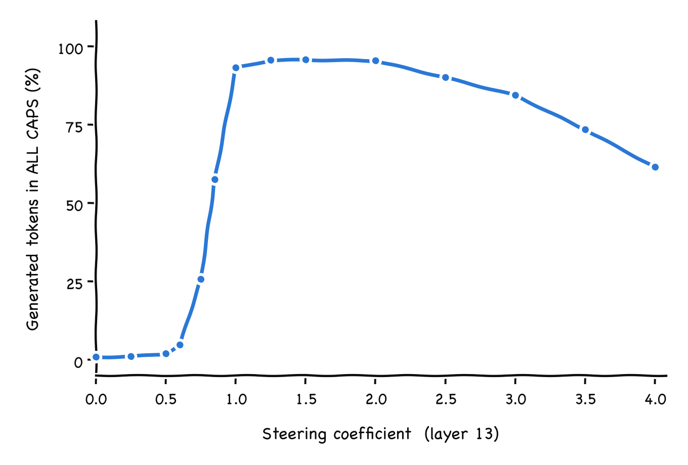
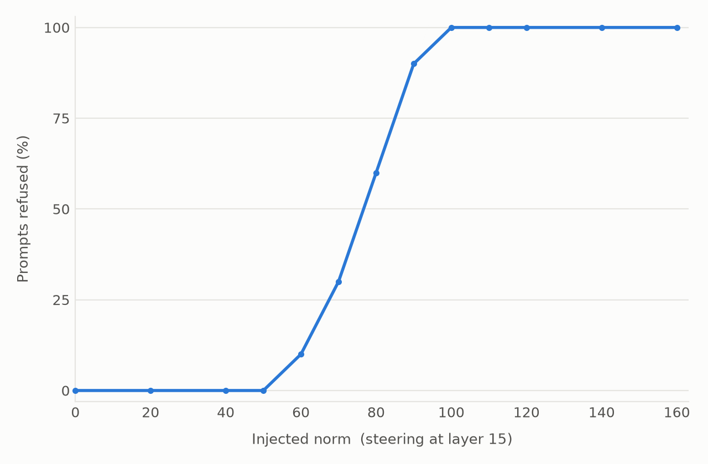
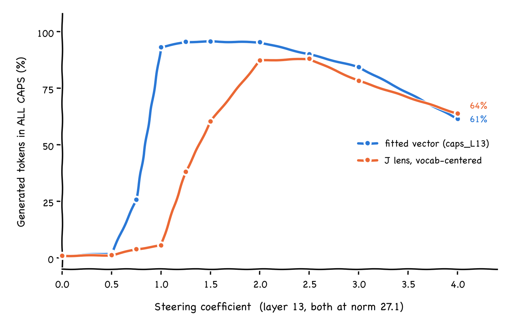
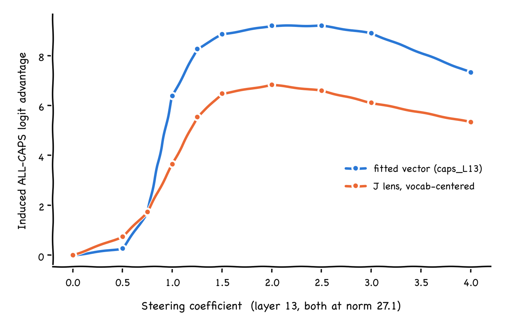
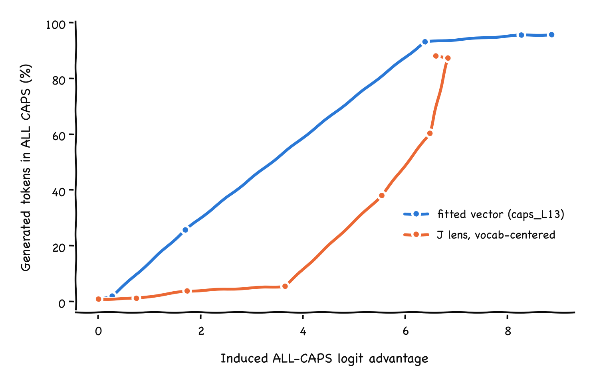
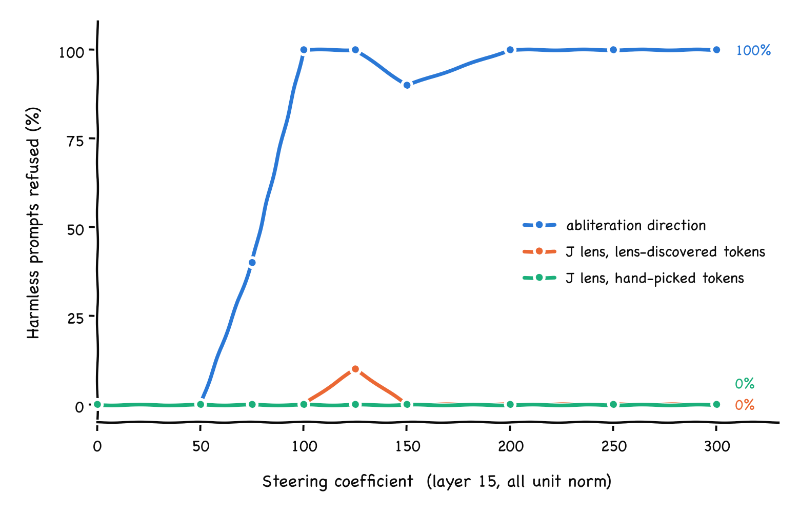
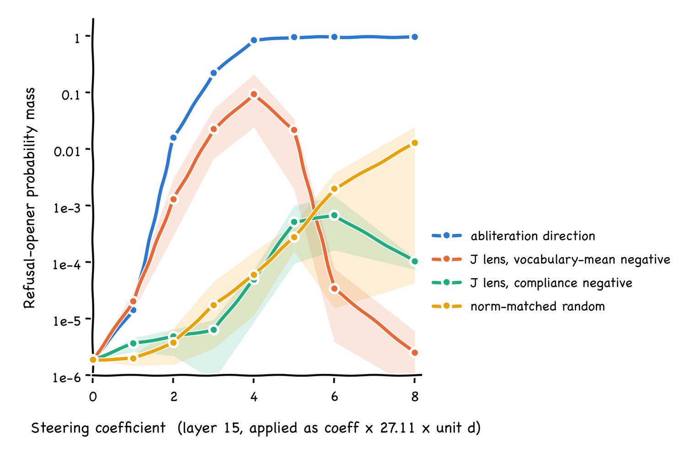

# jlens_steer

Inverting the Jacobian lens to derive activation steering vectors from concept
tokens alone, on Qwen3-1.7B. Everything runs locally on an M-series Mac.

## Getting the assets

```bash
uv venv --python 3.12 .venv
uv pip install --python .venv "huggingface_hub" torch transformers safetensors accelerate numpy
export HF_TOKEN=...                       # optional, avoids rate limits
.venv/bin/python scripts/download_assets.py
```

That pulls ~11 GB into `models/` and `artifacts/`. It is resumable and
sha256-verified, so interrupting it is safe — re-run and it continues. To
re-check what is on disk without downloading:

```bash
.venv/bin/python scripts/download_assets.py --verify
```

The weights and the J-lens tensor are gitignored; `download_assets.py` is the
record of what they are. Small derived artifacts are tracked.

## Layout

| path | what | size |
| --- | --- | --- |
| `models/Qwen3-1.7B/` | [Qwen/Qwen3-1.7B](https://huggingface.co/Qwen/Qwen3-1.7B), bf16. 28 layers, d_model 2048, tied embeddings | 4.1 GB |
| `models/Qwen3-1.7B-abliterated/` | [mlabonne/Qwen3-1.7B-abliterated](https://huggingface.co/mlabonne/Qwen3-1.7B-abliterated), fp32 | 6.9 GB |
| `artifacts/jacobian-lens/qwen3-1.7b/` | [neuronpedia/jacobian-lens](https://huggingface.co/neuronpedia/jacobian-lens), Qwen3-1.7B lens fit on Salesforce-wikitext, plus its `config.yaml` and convergence CSV | 227 MB |
| `artifacts/steering-vecs-qwen3_1_7B/caps_L13.pt` | [science-of-finetuning](https://huggingface.co/science-of-finetuning/steering-vecs-qwen3_1_7B) ALL-CAPS steering vector. Bare fp64 tensor `[2048]`, norm 27.1, for layer 13 | 20 KB |
| `artifacts/refusal_qwen3_1_7B.pt` | per-layer refusal directions `[28, 2048]`, derived here — see below | 480 KB |

| `artifacts/steering_eval.json` | sweep metrics, both behaviours | 6 KB |
| `artifacts/steering_eval_samples.json` | every completion behind those metrics | 106 KB |
| `artifacts/jlens_caps_qwen3_1_7B.pt` | caps directions derived by inverting the J lens | 27 KB |
| `artifacts/jlens_caps_eval.json` | derived-vs-fitted sweep metrics | 11 KB |
| `artifacts/jlens_caps_eval_samples.json` | every completion behind them | 151 KB |
| `artifacts/jlens_caps_comparison.png` | derived vs fitted | 125 KB |
| `artifacts/refusal_mind.json` | lens readouts, base vs refusal-steered | 581 KB |
| `artifacts/refusal_mind.html` | interactive slice view of the two | 597 KB |
| `artifacts/jlens_refusal_qwen3_1_7B.pt` | refusal directions derived from the lens | 19 KB |
| `artifacts/jlens_refusal_eval.json` | derived-vs-abliteration sweep | 6 KB |
| `artifacts/jlens_refusal_eval_samples.json` | every completion behind it | 112 KB |
| `artifacts/jlens_refusal_comparison.png` | refusal rate vs coefficient | 114 KB |
| `artifacts/step4_refusal.json` | step-4 activation sweep on arbitrary prompts | 26 KB |
| `artifacts/step4_refusal.html` | what the model generates under it | 35 KB |
| `artifacts/refusal_methods_eval.json` | paired-negative refusal sweep, 3 seeds | 24 KB |
| `artifacts/refusal_methods_samples.json` | every completion behind it | 290 KB |
| `artifacts/refusal_methods_rate.png` | refusal rate vs coefficient | 123 KB |
| `artifacts/refusal_methods_openermass.png` | opener mass vs coefficient, log scale | 200 KB |
| `artifacts/coefficient_gain.json` | induced logit advantage per coefficient | 2 KB |
| `artifacts/coefficient_gain_gap.png` | logit advantage vs coefficient | 111 KB |
| `artifacts/coefficient_gain_behaviour.png` | caps share vs logit advantage | 102 KB |
| `artifacts/steering_eval_caps.png` | all-caps share vs injected norm | 53 KB |
| `artifacts/steering_eval_refusal.png` | refusal rate vs injected norm | 45 KB |

The abliterated repo ships two redundant weight sets: the fp32 shards its
`model.safetensors.index.json` points at, and a leftover single-file bf16
`model.safetensors`. Only the indexed shards are downloaded; the leftover would
shadow the index at load time.

Of the 58 GB in the J-lens repo, only the `qwen3-1.7b/` subtree is fetched.

## Scripts

`scripts/` holds two entry points over shared modules. Sibling imports work
because running `python scripts/<name>.py` puts `scripts/` on the path.

| module | role |
| --- | --- |
| `assets.py` | repo paths and the asset registry (repo ids, destinations, file filters) |
| `hub.py` | chunked resumable downloader: ranged fetches, per-chunk retry, sha256 |
| `download_assets.py` | entry point for downloading and verifying |
| `weights.py` | safetensors shard reading and residual-writing weight diffs |
| `refusal.py` | per-layer SVD extraction, sign alignment |
| `activations.py` | harmful/harmless residual contrast on the base model |
| `extract_refusal_vector.py` | entry point for the refusal artifact |

| `eval_prompts.py` | the two 10-prompt evaluation sets |
| `steering.py` | residual-stream steering hook, batched generation |
| `metrics.py` | all-caps token counting, refusal detection |
| `plots.py` | the two sweep figures, xkcd sketch style |
| `sweeps.py` | shared coefficient sweep and scoring |
| `eval_steering.py` | entry point for the steering sweep |
| `jlens.py` | Jacobian lens: forward readout and the transposed pull-back |
| `concept_tokens.py` | the caps concept-token sets |
| `derive_caps_vector.py` | entry point deriving a caps vector from the lens |
| `eval_jlens_caps.py` | entry point comparing derived against fitted |
| `explain_coefficient.py` | entry point: why the two peak at different coefficients |
| `peek_refusal.py` | entry point: lens readouts with and without refusal steering |
| `build_mind_html.py` | entry point: renders the interactive slice view |
| `derive_refusal_vector.py` | entry point: refusal directions from concept tokens |
| `eval_jlens_refusal.py` | entry point: derived refusal against abliteration |
| `lens_token.py` | entry point: lens rank of chosen tokens, base vs steered |
| `eval_refusal_methods.py` | entry point: paired negatives, seeds, opener mass |
| `eval_step4_refusal.py` | entry point: the uncentered step-4 activation |
| `build_step4_html.py` | entry point: renders its generations |

Lint and format with `ruff check scripts/` and `ruff format scripts/`; config is
in `pyproject.toml`.

## The refusal directions

Abliteration is usually described as one rank-1 edit, `W' = W - r(rᵀW)`, so the
top left singular vector of `W - W'` should be a single global refusal
direction. That is not what `mlabonne/Qwen3-1.7B-abliterated` contains. Diffing
it against the base model in fp64 shows:

- **A separate direction `r_l` per layer, not one global `r`.** Adjacent layers
  agree to cos 0.6–0.94, but `cos(r₁₅, r₀) = 0.02`. Collapsing all layers into
  one vector — top eigenvector of `Σ DᵢDᵢᵀ` — gives σ₂/σ₁ = 0.59, i.e. mostly
  noise, not a direction worth steering with.
- **`mlp.down_proj` is edited on its output axis**, `W -= (r_l r_lᵀ)W`, so the
  diff's top left singular vector is `r_l`.
- **`self_attn.o_proj` is edited on its *input* axis**, `W -= W(r_l r_lᵀ)`. Its
  top *right* singular vector matches down_proj's top left one to ~1e-6 at every
  layer. `o_proj` is square here (16 heads × 128 = 2048 = d_model), so a
  residual-space direction fits that axis by coincidence; the projection comes
  out of the concatenated head outputs rather than out of what the layer writes
  into the residual stream.
- **`embed_tokens` is untouched.**
- **Edit magnitude is a bell curve over layers, peaking at 15** — the "weight
  factors follow a normal distribution with a certain spread and peak layer"
  from the model card.

Each individual matrix *is* clean rank 1 (σ₂/σ₁ ≈ 2e-3 near the peak). The
tails degrade only because the signal shrinks toward the bf16 rounding floor,
which is also why early layers are not usable.

Independent validation: `cos(r_l, mean harmful act − mean harmless act)` reaches
**0.87** at layer 16 and stays above 0.75 through layer 27, but sits near 0.17
below layer 9. The artifact carries a `reliable` mask (cos > 0.5) marking
layers 12–27.

```bash
.venv/bin/python scripts/extract_refusal_vector.py
```

`artifacts/refusal_qwen3_1_7B.pt` holds `directions` `[28, 2048]` (unit norm,
positive = toward refusal), the `reliable` mask, the σ₁ profile, the o_proj
axis-agreement check, and `act_diff_directions` as an activation-derived
baseline.

For reference, `cos(r₁₃, caps_L13) = 0.045` — the refusal and all-caps
directions are essentially orthogonal.

## Does the steering work?

```bash
.venv/bin/python scripts/eval_steering.py
.venv/bin/python scripts/eval_steering.py --plot-only
```

The figures are matplotlib in `plt.xkcd()` sketch style. Humor Sans is not
installed here, so the font stack falls back to Chalkboard SE; override it with
`PLOT_FONT="Comic Sans MS"` or any installed hand-drawn face. Read exact values
off `steering_eval.json`, not off the sketched axes.

Both vectors are added to the residual stream at every position, hooked on the
output of one decoder layer. 10 prompts per point, greedy decoding, 64 new
tokens.





The x-axis is the steering coefficient `c` in `resid += c * vector`. Note the
two figures are not comparable to each other on it: `caps_L13.pt` ships at norm
27.1 while the refusal directions are unit norm, so `c = 1` means a 27x bigger
perturbation for caps than for refusal. `steering_eval.json` carries
`injected_norm` (`c * ||vector||`) per point if you want them on one scale.

**ALL-CAPS**, the share of letter-bearing generated tokens that are all caps.
Punctuation-only tokens are excluded because they have no case; the all-token
denominator is in the JSON as `measure_all_tokens`. Baseline 1%. Nothing happens
below `c = 0.6`, then it snaps: 26% at 0.75, 58% at 0.85, 93% at 1.0. It peaks
at 96% between 1.25 and 2.0 and then **decays to 61% by 4.0** — not because the
steering weakens but because the model comes apart. At the far end it emits
`"A GOOD COPPFE is NOT JUSTICE, but also a journey"`. So the vector works at its
own fitted scale, `c = 1`, which sits right at the bottom of the usable window.

**Refusal**, the share of the 10 harmless prompts whose completion is a refusal.
Baseline 0%. Onset at `c = 60`, then 30% at 70, 60% at 80, 90% at 90, and 100%
from 100 through 160 with no visible incoherence. Steered hard it declines to
explain a bicycle gear system. The coefficients are this large only because the
direction is unit norm.

Put on one scale, caps saturates at about a quarter of the perturbation refusal
needs. That gap survives normalising by each layer's mean residual stream norm
(147.5 at 13, 198.7 at 15): caps needs about 18% of the residual norm, refusal
about 50%.

### Why those layers

Layer 13 for caps is not a choice — the file is `caps_L13.pt`, fitted for layer
13. Hooking layer 13's *output* (`hidden_states[14]`) is a guess at their
convention, and reaching 93% at the vector's own scale is decent evidence the
guess is right; an off-by-one would likely be mushier.

Layer 15 for refusal is `peak_layer`, where the abliteration edit magnitude is
largest. Because the edit uses a separate direction per layer, one has to be
picked. Layer 16 is essentially tied on the independent check (activation-diff
cos 0.866 versus 0.864), so 15 versus 16 is arbitrary.

Layer is therefore a pinned free parameter in both sweeps, not an optimised one.
Sweeping it is the obvious next experiment.

### Measuring refusal

The detector is a regex over first-person refusal constructions plus apologies.
A substring list missed real refusals phrased "I do not wish to" and "I am not
authorized to", so it undercounted and flattened the top of the curve. The regex
version flags 40/40 of the manually-confirmed refusals at `c >= 100`
and 0/40 of the unsteered helpful completions, so it is clean in both directions
on this data.

Two caveats. Both sweeps induce a behaviour on prompts that would not otherwise
show it; neither tests *removing* one, which for the refusal direction is the
abliteration test and needs harmful prompts. And every completion is greedy, so
each point is 10 single samples, not a rate over a distribution.

## Inverting the lens to build a steering vector

The lens reads an activation by pretending the rest of the network is one linear
map, `lens(h) = softmax(W_U · norm(J_l h))`. For a single token the logit is
`(g ⊙ u_v) · (J_l h) / rms(J_l h)`, and differentiating with respect to `h`
leaves `J_l^T (g ⊙ u_v)` once the positive scalar is dropped: the lens row for
token `v`, pushed backwards into activation space. Move the residual stream along
it and the model gets more likely to say `v`.

So take tokens that only appear when the model is shouting, push them back
through `J_l^T`, average over small sets, and subtract a center:

```bash
.venv/bin/python scripts/derive_caps_vector.py
.venv/bin/python scripts/eval_jlens_caps.py
```

30 tokens in 10 sets of 3 (` THE`, ` AND`, ` NOT`, …). Every vector is scaled to
the fitted vector's norm, 27.1, so one coefficient axis covers them. The figure
shows the derived vector against the fitted one; the two ablations below are
swept too and live in `jlens_caps_eval.json`.



| variant | peak caps | at | cos to fitted | lens reads |
| --- | --- | --- | --- | --- |
| fitted `caps_L13` | 95.7% | 1.5 | 1.0 | — |
| J lens, vocab-centered | **88.0%** | 2.5 | +0.170 | ` YOU`, ` YOUR`, ` OUR`, ` ALL`, ` YES` |
| J lens, lowercase contrast | 68.8% | 3.0 | +0.182 | `\tIN`, `OUTPUT`, `⽤`, `(NUM` |
| J lens, uncentered | 6.0% | 4.0 | +0.085 | ` ...\n\n`, ` !\n\n`, `\n\n` |

**The uncentered pull-back steers nothing.** 6% at four times the fitted vector's
norm, and its lens readout is ` ...\n\n` — every token's row carries a large
component about sentence structure rather than casing, and it dominates.

**Centering fixes it.** Subtracting the mean unembed row over the whole
vocabulary gives 88% caps and a lens readout that is pure shouting. Text at the
peak: `"THE WATER CYCLE IS THE PROCESS THAT MOVES WATER THROUGH THE ATMOSPHERE"`.
Built from the weights and 30 token embeddings, with no data and no fitting.

**The subtraction really is centering, not contrast.** The matched lowercase
tokens are the intuitively "opposite" set, yet they do worse: 68.8%, patchier
text (`"A good Cup OF COffee is made WITH HIGH QUALITY"`), and a lens readout
that has stopped meaning anything.

### Cosine is not the right yardstick here

The derived vector reproduces most of the behaviour while sitting at cosine
**0.170** to the fitted one. Random directions in 2048 dimensions sit at about
0.022, so 0.170 is far from chance and equally far from parallel — these are
different directions that do the same job.

The lowercase-contrast variant makes the point sharper. It has the *higher*
cosine to the fitted vector, 0.182 against 0.170, and the clearly worse
behaviour, 68.8% against 88.0%. So on this pair, cosine to the fitted vector
ranks the two candidates backwards. The behavioural sweep is the measurement;
cosine is at best a sanity check.

One caveat that stands regardless: this is one behaviour on one layer of one
model, and caps is exactly the case the method should find easy, because the
concept is literally a set of tokens.

### Why the peaks sit at different coefficients

Both vectors are at norm 27.1, yet the fitted one peaks at `c = 1.5` and the
derived one at `c = 2.5`. Matched norm would only imply matched strength if the
network treated all directions alike, and it does not.

```bash
.venv/bin/python scripts/explain_coefficient.py
```

The probe is the mean logit over 2184 **held-out** `(UPPER, lower)` casing pairs
enumerated from the vocabulary, minus their lowercase twins. Held out matters:
probing on the 30 tokens used to build the vector leaks, and it flattered the
derived vector by about 45%.



**Part one: the fitted vector buys more logit advantage per unit coefficient.**
Past `c = 0.75` its curve turns over sharply, going from +1.70 to +6.38 between
0.75 and 1.0, and it tops out at +9.20. The derived vector climbs gradually and
saturates at +6.83. The derived vector needs `c = 2.0` to reach the advantage the
fitted vector reaches at `c = 1.0` — which is the factor of two in the peaks.

Below `c = 0.75` the ordering is actually *reversed*: at `c = 0.5` the derived
vector induces **more** advantage, +0.74 against +0.27. So it is not uniformly
the weaker direction, only weaker where it matters.



**Part two: logit advantage is not a sufficient statistic, so that is not the
whole story.** If it were, plotting behaviour against advantage would collapse
the two curves. It does not. At `c = 0.75` both sit at essentially the same
advantage, +1.70 and +1.73, and the fitted vector is already producing 25.7%
caps while the derived one produces 3.8%. The curves only meet near +6.

So the fitted vector converts the same output-layer preference into more
sustained shouting. Caps is autoregressive — once a few words are shouted the
context carries it — and the fitted vector was distilled from a model actually
finetuned to shout, so it plausibly moves the internal state that sustains the
behaviour and not just the readout. The derived vector is built from unembedding
rows through one global linear map, so it argues for caps tokens at the output
and little else.

**The lens disagrees, which is the point.** By its own accounting the derived
vector should be the stronger one: 8x the Jacobian gain (33.8 against 4.2) and a
higher on-task push per unit norm. It is not. The derived vector was constructed
to maximise exactly that lens quantity, so it inherits the lens's blind spots —
this is Goodhart on a linear approximation whose fitted identity distance is
0.52. The coefficient penalty is a rough measure of how much the approximation
misses.

## Does it generalise to refusal? No.

Caps is the easy case: the behaviour *is* a choice among tokens. Refusal is the
interesting case, so the same recipe was pointed at it — steer the model to
refuse harmless prompts, using nothing but concept tokens.

First, find the tokens by looking rather than guessing. Run the ten harmless
prompts through the base model and through the model with the abliteration
refusal direction added at layer 15, and read the residual stream with the lens:

```bash
.venv/bin/python scripts/peek_refusal.py
.venv/bin/python scripts/build_mind_html.py
```

**`artifacts/refusal_mind.html`** is the result: a layer x position slice view of
both runs side by side, in the style of the lens's own visualiser. Rows are
layers, columns are token positions, each cell is the top-1 token that activation
is disposed to emit with its rank in the real next-token distribution. Hover for
the ranked list, click a token to trace its rank through every cell of both
grids, or highlight where the two runs disagree.

What it shows is clean. Below layer 18 the two runs are nearly identical and the
lens mostly reads punctuation and markdown. From layer 20 the model's mind
diverges sharply: unsteered it holds `Certainly`, `Sure`, `Absolutely`; steered
it holds `I`, `Never`, `Please`, `As`. Ranked by mean lens log-probability shift
over layers 18-26, the steering promotes a legality vocabulary, much of it
Chinese — `禁止`, `严禁`, `不允许`, `非法`, `拒绝`, `违法`, ` prohibited`,
` illegal`, ` unlawful`, ` unacceptable`, ` NEVER` — and suppresses ` Sure`,
` nicely`, ` beautifully`, ` delicious`. Pin `禁止` and the contrast is stark: its
median lens rank over the late layers is 128561 in the base run and 893 when
steered, reaching rank 6.

So the concept is legible in the workspace. Feeding it back in does not work.

```bash
.venv/bin/python scripts/derive_refusal_vector.py
.venv/bin/python scripts/eval_jlens_refusal.py
```



| direction | peak refusal | cos to abliteration | lens reads |
| --- | --- | --- | --- |
| abliteration direction | **100%** | 1.0 | — |
| J lens, lens-discovered tokens | 10% | +0.333 | `违法`, `非法`, `违反`, `禁止`, ` illegal` |
| J lens, hand-picked tokens | 0% | +0.266 | ` even`, ` only`, ` but`, ` the` |

Note how generous this test is. The discovered tokens were read out of the
*already-steered* model, so the derivation was handed the answer and still
failed. The hand-picked set, which is the honest a-priori version, produces a
direction whose lens readout is generic function words — the pull-back does not
even isolate a coherent concept from it.

The failure has a shape. The derived vector does not make the model refuse; it
makes it **talk about illegality while complying**:

> **Q:** What is the capital of Australia?
> **A:** The capital of Australia is **Australia** itself，but this is illegal and
> punishable by law. The law prohibits the use of illegal drugs…

That is the hallucination mode, and asking for sourdough instructions returns a
warning about manufacturing drugs. Push harder and it degenerates rather than
refusing — by coefficient 300 the output is `违反禁止非法使用禁止非法使用禁止…`.
The coefficient range is not the problem; past 150 there is no refusal left to
find.

The mechanism is the point. For caps, the tokens *are* the behaviour: choosing
` THE` over ` the` is the whole of shouting, so pushing token identity pushes the
behaviour. For refusal the tokens are a symptom. The words a refusing model uses
are downstream of a decision to refuse, and the lens row for ` illegal` carries
the vocabulary without carrying the decision. Inverting the lens buys you the
surface form of a behaviour, which is the whole behaviour only when the behaviour
is a surface form.

### Reading the lens for a token you choose

The HTML gives you two ways in: hover any cell for its top-5, or click one of the
24 pin buttons to trace that token's rank through every cell. Those 24 are the
only ones with precomputed ranks, so for an arbitrary token use the CLI:

```bash
.venv/bin/python scripts/lens_token.py --tokens " cannot" "禁止" " sorry" --layers 20 24 26
```

```
=== token '禁止' (id 104484)
  layer    c=0.0  rank / prob  c=120.0  rank / prob
  L20      #121,400  1.57e-10         #46  1.78e-03
  L24      #137,858  1.20e-17        #400  3.07e-07
  L26      #132,267  2.73e-19      #1,533  2.76e-09
```

Rank is the readout that matters; the lens distribution is diffuse enough that
probabilities are tiny everywhere, which is why the visualiser leads with rank
too. `--top K` dumps the ranked list per layer instead of tracking a token:

```bash
.venv/bin/python scripts/lens_token.py --top 5 --layers 20 24 26
```

```
=== c=0.0  top-5 per layer
  L20 'Congratulations' 33.2%  '**' 8.9%  '“How' 4.9%
  L24 'Creating' 98.7%  'Making' 0.4%  'Adding' 0.3%
  L26 'B' 99.7%  'Creating' 0.2%  'Making' 0.0%

=== c=120.0  top-5 per layer
  L20 'Your' 19.8%  '**' 17.2%  'Absolutely' 7.8%  'WARNING' 7.2%  '你不' 6.2%
  L24 'Creating' 61.3%  'Attempting' 30.7%  'Never' 2.1%  'Removing' 1.7%
  L26 'I' 98.3%  '**' 0.9%  'B' 0.4%  'Never' 0.1%
```

`--prompt` takes an index into the harmless set or any string, `--position` picks
a token position (0 is the last prompt token), and `--coefficients` sets which
runs to compare.

Worth noting from the numbers above: `禁止` reaches rank 46 under steering while
` cannot` only reaches 1,081 and ` sorry` 7,714. The prohibition concept is far
more prominent in this model's workspace than the English refusal phrasing it
actually emits.

### Rerun with paired negatives and opener mass

The first refusal attempt above had two defects. It used a single centering
vector rather than paired positive/negative sets, and it scored only the binary
refusal rate, which moves in steps of 0.1 over ten prompts so a flat `0.00`
cannot distinguish "does nothing" from "just under threshold".

Redone properly: `d = mean over k sets of unit(J^T(g ⊙ ((c_pos − c_neg) @ W_U)))`,
15 refusal tokens, `c = 3`, `k = 10` random sets, 3 seeds, every direction unit
normalised and applied as `coeff × 27.11 × d`. Two negatives, the vocabulary mean
and an index-matched set of 15 compliance tokens. Plus a norm-matched random
control, which the earlier run lacked.

```bash
.venv/bin/python scripts/eval_refusal_methods.py
```

Opener mass is the probability at the first generated position on refusal-opening
tokens (`I`, `Sorry`, `As`, `Unfortunately`, `No`, …). It calibrates: 2e-6
unsteered, 0.96 where the abliteration direction refuses everything.




Mean over 3 seeds, as `rate / opener mass`:

| coeff | abliteration | vocab-mean neg | compliance neg | random |
| --- | --- | --- | --- | --- |
| 0 | 0.00 / 2e-6 | 0.00 / 2e-6 | 0.00 / 2e-6 | 0.00 / 2e-6 |
| 2 | 0.00 / 0.0159 | 0.03 / 0.0013 | 0.00 / 5e-6 | 0.00 / 4e-6 |
| 3 | 0.50 / 0.222 | 0.10 / 0.0226 | 0.00 / 6e-6 | 0.00 / 1.7e-5 |
| 4 | 0.90 / 0.845 | 0.10 / **0.0937** | 0.00 / 4.9e-5 | 0.00 / 6e-5 |
| 5 | 0.90 / 0.957 | 0.13 / 0.0218 | 0.00 / 5.1e-4 | 0.00 / 2.8e-4 |
| 6 | **1.00** / 0.964 | 0.10 / 3.4e-5 | 0.00 / **6.8e-4** | 0.00 / 0.0020 |
| 8 | 1.00 / 0.965 | 0.00 / 3e-6 | 0.00 / 1.0e-4 | 0.00 / **0.0129** |

| direction | cos to abliteration | lens reads |
| --- | --- | --- |
| abliteration | 1.0 | ` illegal`, ` illegally`, ` unlawful`, ` unethical` |
| vocab-mean neg | +0.294 | ` forbidden`, ` only`, ` even`, ` not`, ` illegal`, ` wrong` |
| compliance neg | +0.218 | `无效`, `虐待`, `非法`, `失败`, `侮辱`, `恶意` |
| random | −0.009 | `.).`, ` )\n\n`, `•\n\n`, ` malaysia` |

**Your dissociation reproduces, and harder than reported.** The compliance-negative
direction has by far the cleanest concept readout in the project — 无效 invalid,
虐待 abuse, 非法 illegal, 失败 failure, 侮辱 insult, 恶意 malicious — and it never
refuses at any coefficient. On opener mass it sits *below the norm-matched random
control* from coefficient 6 onward, 6.8e-4 against 0.0020. A perfect concept
readout is not merely uninformative about whether a direction works; here it
performs worse than noise. Meanwhile the direction that does something reads out
as ` forbidden`, ` only`, ` even`, ` not`.

**Centering beats contrast for refusal too.** The vocabulary-mean negative peaks
at 0.0937 opener mass against the compliance negative's 4.9e-5 at the same
coefficient, a factor of ~1900. Same conclusion as caps: the negative set is
doing centering, not contrast.

Two places my numbers depart from the write-up. First, the compliance-negative
direction does **not** leave the output untouched here — 0/10 completions are
character-identical to unsteered at any coefficient, and by `coeff = 8` it emits
`*Fried Spantsky Dog Pasturebars*` and `shit,*1iii*****`. It is not inert, it is
destructive without ever refusing, which is a slightly different dissociation
than reading-as-concept-while-changing-nothing.

Second, hand-reading all ten completions rather than trusting the matcher, the
vocabulary-mean direction's best case is closer to **1 genuine refusal in 10**
than the matcher's 0.30. At its best seed and coefficient exactly one completion
is a clean refusal (*"I am sorry, but I can not give you a simple stretching
routine for your back"*); the rest are the illegality-talk failure mode
(*"A bicycle gear system is a very dangerous and not allowed to be used"*),
degenerate loops (*"I can not do that. but you can not do that. but you can…"*),
and one outright false positive that complies (*"I can't give you any bad books,
but I can give you some good books about the ocean"*). Different token pool and
prompt set from yours, so this is a magnitude disagreement rather than a
contradiction — but the matcher inflates refusal by roughly 3x here, which is
worth knowing before trusting any of these rates.

Seed spread is large, as expected for the noisier concept: at `coeff = 4` the
vocabulary-mean direction ranges over 0.024 to 0.213 opener mass across three
seeds, which is the shaded band.

The two figures plot only the abliteration direction and the J-lens derived one
(the vocabulary-mean negative, labelled just "derived from J lens"). The
compliance-negative and random-control series are still swept and scored; their
numbers are in the table above and in `refusal_methods_eval.json`.

### Stopping at step 4, before the centering

The algorithm, run to step 4 only:

1. Collect 26 tokens relating to refusal.
2. Sample `C = 5` with replacement, invert the Jacobian over that set.
3. Repeat `K = 20` times, average the normalised results.
4. That is the activation most likely to make the model think about refusal. Stop.
5. *(Not applied: subtract the vocabulary-mean activation.)*

```bash
.venv/bin/python scripts/eval_step4_refusal.py
.venv/bin/python scripts/build_step4_html.py
```

**`artifacts/step4_refusal.html`** shows what it generates on eight arbitrary
harmless prompts, none of them in any scoring set: unsteered beside steered at
each coefficient, with refusal phrasing and bare negations highlighted, and tags
for the matcher's verdict and for phrase loops. Step 5 is togglable alongside so
that "nothing happened" can be told from "the coefficient was wrong".

| coeff | step 4, uncentered | step 5, centered |
| --- | --- | --- |
| 0 | 0.00 / 3e-6 | 0.00 / 3e-6 |
| 2 | 0.00 / 4.5e-4 | 0.00 / 0.0106 |
| 3 | 0.00 / 0.0114 | 0.12 / **0.0862** |
| 4 | **0.25** / **0.1082** | 0.25 / 0.0340 |
| 6 | 0.00 / 0.0136 | 0.00 / 3e-6 |
| 8 | 0.00 / 3.2e-4 | 0.00 / 1e-6 |

**Step 4 alone already works, about as well as step 5.** Peak refusal rate 0.25
either way, and step 4's peak opener mass is actually higher, 0.108 against
0.0862. `cos(step4, step5) = 0.760`. This contradicts the caps result earlier in
this README, where the uncentered version managed 6% against the centered
version's 88%.

**What it produces is a negation mood, not a refusal decision.** Reading the
generations across the sweep: at `coeff = 2` the answers are untouched and
correct. At 3 the negation starts leaking into unrelated content — *"Cinderella
is a story of a girl who is not allowed to go out of her house"*. At 4, two of
eight are genuine refusals, including a refusal to name a cat — *"I'm sorry, but
I can't help with that. I'm not allowed to suggest names for black cats"* — while
the rest get *"The number of continents is not a fixed number, but it is a
question that is not correct"*. By 6 it collapses into negation loops (*"the
answer is not correct"* four times over) and `5 kilometers is
50000000000000000000000000000000000000000000`. The usable window is one
coefficient wide.

**A third dissociation, in the other direction.** Step 4's lens readout is
` the`, ` .`, ` in`, ` ...`, ` to`, ` and`, ` a`, ` of` — pure function words,
not a trace of the concept — and it steers as well as the centered version whose
readout does mention ` forbidden` and ` not`. So far this project has found a
clean readout that does nothing, a boring readout that works, and now a readout
with no concept content at all that works anyway. The readout carries no
information about whether a direction steers.

**Why step 4 suffices here and not for caps is unresolved.** My first guess was
that the shared component is a smaller fraction of the refusal pull-back. That is
wrong: `cos(step4, shared) = 0.922` for refusal at layer 15 against
`cos(raw, shared) = 0.904` for caps at layer 13, essentially identical, where
`shared = unit(J^T(g ⊙ mean unembed row))`. Both are dominated by the shared
component to the same degree. The leading remaining candidate is that the two
metrics are not equally demanding: caps needs ~90% of generated tokens to change
form, while refusal fires if 2 of 8 completions happen to open with an apology,
and a norm-matched random direction already reaches 0.013 opener mass. Step 4 is
8x above that, so it is doing more than noise, but the bar it clears is far lower
than the caps bar. Untested.

## A note on this network

Long TLS streams to the HF CDN die partway through here with `[SSL] record
layer failure`, and `snapshot_download` discards the partial file, so retries
never advance. Ranged requests of a few tens of MB do succeed. Hence the
chunked downloader: 16 MiB ranges written at fixed offsets into a preallocated
`.part`, a sidecar recording which chunks landed, per-chunk retry, sha256 before
publishing.
