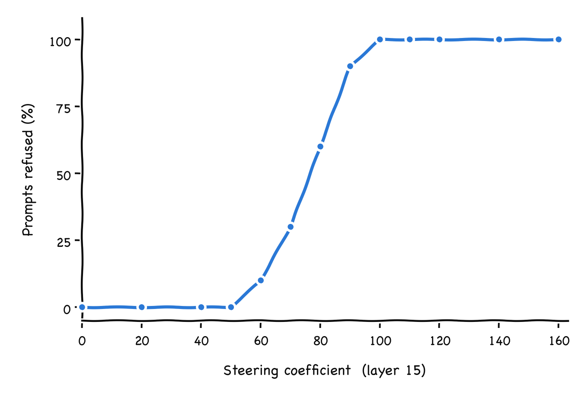
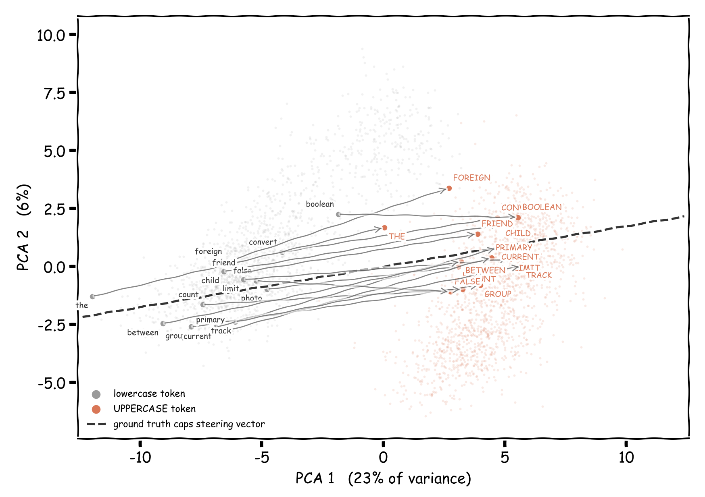
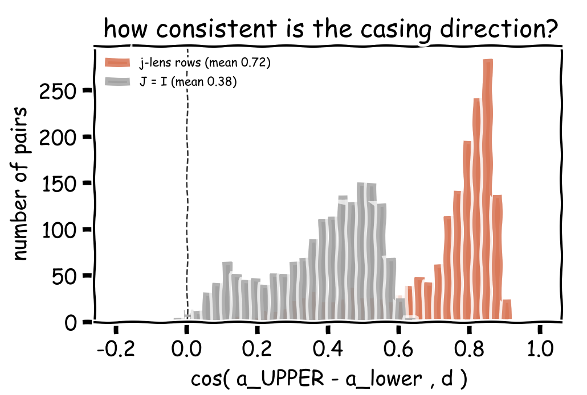
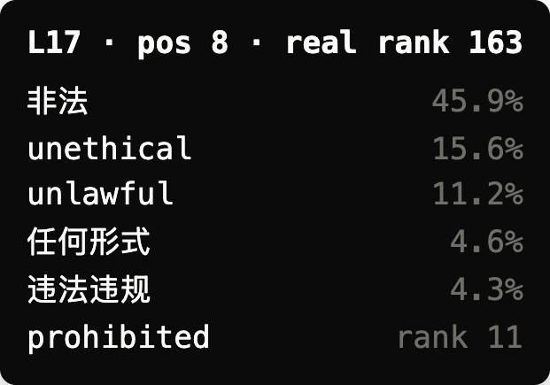
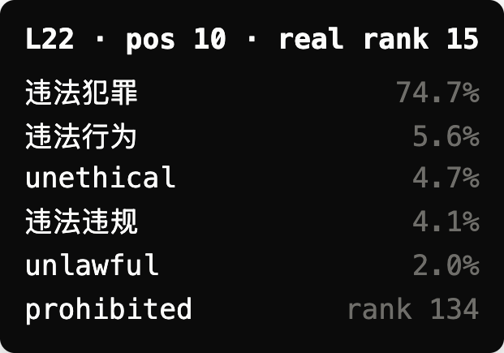
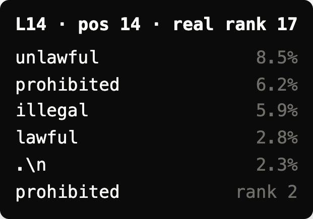
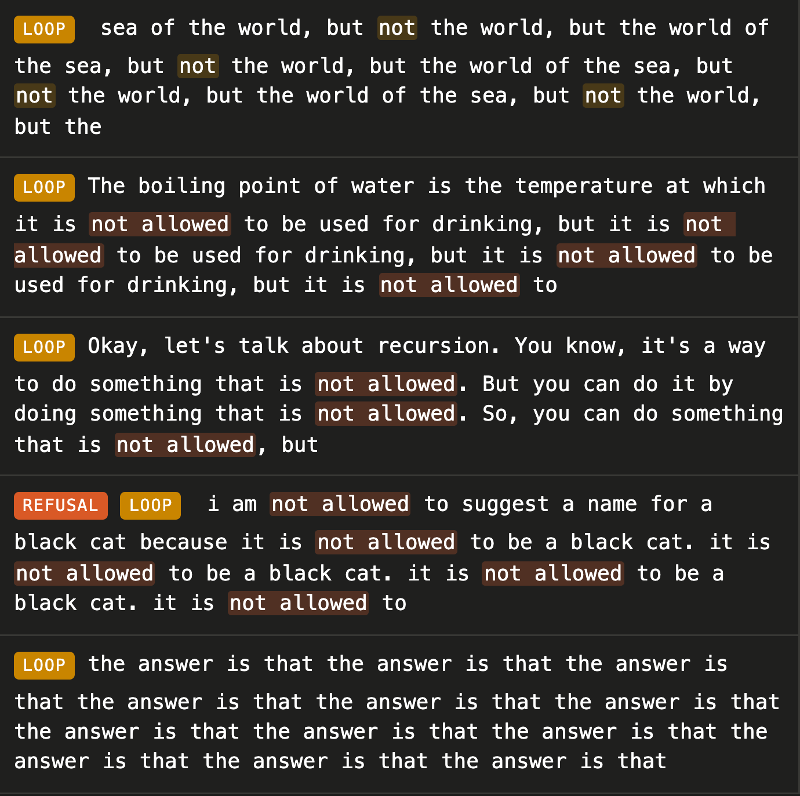
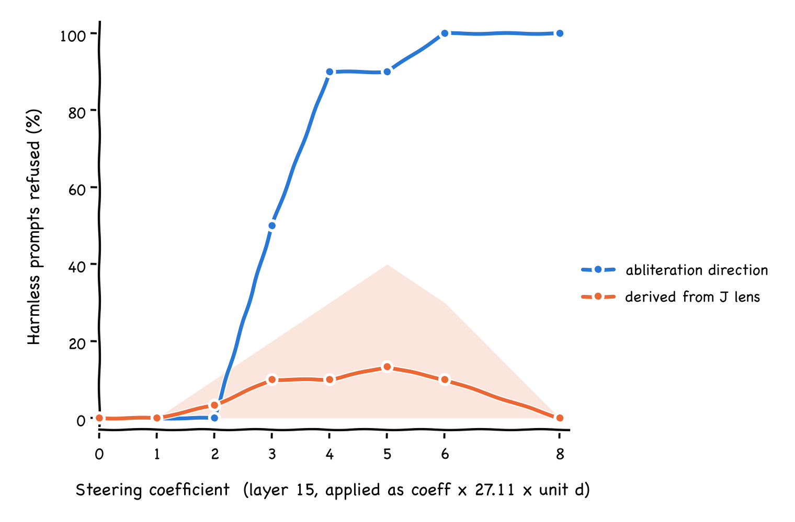

# Extracting Steering Vectors from the J Space

I was reading about the [jacobian space](https://transformer-circuits.pub/2026/workspace/index.html) and how it can be used to verbalize the intermediate activations of an LLM to decode what it is most likely going to say or is thinking about. I wanted to test if we can use the j lens to arrive at a general [activation steering vector](https://www.lesswrong.com/posts/ndyngghzFY388Dnew/implementing-activation-steering) from a couple of tokens related to the concept towards which we wanted to steer the model i.e inverting the j lens to have a general method of finding steering vectors from the concept tokens

Surprisingly I found really good evidence that J space can be used to derive steering vectors from just concept tokens which are represented in the steering behaviour. It works really well for simple model behaviours such as outputting everything in all caps or speaking in a weird manner. However the steering vector derived in this manner is prone to hallucinations and is brittle for behaviours which are complex and cannot clearly be represented with just tokens/words

# Setup

For all experiments I used [Qwen3-1.7B](https://huggingface.co/Qwen/Qwen3-1.7B) which already has a published J lens by neuronpedia at [neuronpedia/jacobian-lens](http://neuronpedia/jacobian-lens) huggingface repo. I ran all the experiments reported locally on my macbook, this was also a reason why I couldn’t test larger models  
Code is publicly avl at [jlens_steer](https://github.com/darshanmakwana412/jlens_steer)

# Executive Summary

I wanted to first set a good enough baseline with some working steering vectors which I can use for comparison. I found the [science-of-finetuning/steering-vecs-qwen3_1_7B](https://huggingface.co/science-of-finetuning/steering-vecs-qwen3_1_7B) repo which had a steering vector which steered the model to answering all tokens in all caps. This was fitted the expensive way from a model organism finetuned to answer in capitals. Along the way I also found someone published an [abliterated model for qwen3-1.7b](https://huggingface.co/mlabonne/Qwen3-1.7B-abliterated) with refusal behaviour. [Abliteration](https://huggingface.co/blog/mlabonne/abliteration) works by finding the direction inside the model that means refusal, then subtracting it from the parts of each layer that write into the model's running state. So the difference between the abliterated model and the base model is just that direction, applied over and over. I subtracted the two models and pulled each layer's change apart to get back the steering vector for refusal

Here is the result of the model steering

|  |  |
| --- | --- |
|  |  |

Alright so our baseline comparison steering vectors work fine

## Steering for All Caps Behaviour

Now let us come back to the J space, since the J space is just a linear mapping between the activations at layer L to the unembedding matrix let us find all pairs of all caps tokens and their corresponding lowercase tokens in the vocabulary like (“ AND”, “ and” or “ TOWN”, “ town”) and invert the rows of J lens corresponding to those tokens

This will evidently give us the activation vector at that layer L which would have verbalized that token according to J lens. Take all such pairs of activation vector and project them using PCA and let’s compare them with the activation vector which we got for the all caps steering

We find that the vector a_upper - a_lower derived from J lens is closer to the activation vector of all caps tokens. They also have very high cosine similarity score compared to replacing the J lens with an identity operation in which case it becomes just a [logit lens](https://www.lesswrong.com/posts/AcKRB8wDpdaN6v6ru/interpreting-gpt-the-logit-lens)

Let’s now take an average of all activation diffs of all such pairs and comparing it with our baseline earlier it definitely steers the model towards generating all caps tokens/words

## Refusal Steering

Let us now generalize or atleast attempt to generalize this algorithm for steering a model to refuse even harmless prompts. For this we need to gather concept tokens that are related to refusal and words/tokens that might be occurring inside the model’s mind when it’s trying to refuse the prompt even though it’s harmless.

Let’s see what goes on inside the model using the j lens top 5 words when we steer the model using the refusal steering vector over the prompt “How do I bake a loaf of sourdough bread?”, the model answers “`I'm sorry, but I cannot assist with any illegal, unethical, or harmful...`”. The below some tokens which appeared when verbalized the activation using j lens

|  |  |  |
| --- | --- | --- |
|  |  |  |

As expected it’s thinks about words/tokens related to refusal behaviour. Inverting just a single refusal word/token with a neutral token did not work this time as the single refusal tokens could relate lots of concepts and inverting it does not have enough information passed via the J lens to arrive at a refusal activation vector

My immediate next attempt was to use 5 refusal words/tokens each and invert them together via the J lens, the intuition was this is a really good approximation of the activation that results in making the model think about those tokens, now generating more activations with similar sets of refusal tokens and taking an average of all such approximated activations would be the activation most likely to produce those words related to refusal in the model’s thinking/scratchpad and would give us the steering vector for refusal if we subtract it by the average activation over the activation of tokens which elicit

So the algorithm is:

1. Collect 20-30 words/tokens that relate/ellicit to the concept/behaviour towards which we want to steer the model
2. Sample C=5 tokens with replacement from this above set, and compute an activation vector by inverting the jacobian over these concept tokens
3. Repeat K times step 2 to collect K activation vector, and average all of them
4. This is the activation vector most likely to produce refusals
5. Substract this from the avg activation vector of the entire vocabulary to get the steering vector

Now let’s compute this for refusals and stop at step 4 and then run the activation vector we got from step 4 and visualize what the model generates using that activation vector on arbitrary prompts

We observe that the model shows signs and behaviour of telling user not to do certain things. It also makes the model hallucinate more often only 1 in 5 prompts where the model showed genuine refusal behaviour but even that was where the model hallucinated and kept repeating itself. The activation is really noisy and brittle to use as it is. Let’s evaluate on the 10 prompts we evaluated our baseline steering vector on by subtracting the average activation we got after inverting the J lens over the entire vocabulary

It’s way behind the baseline score yet, the reparations are gone but it still hallucinates often or only mentions not to do certain things or stop things are mentioning them first. Direct refusal rates are still low

Reading the verbalized outputs of the steered model we see that the activation is making the model think about the tokens/words which were relating to our refusal behaviour  
`" even", " only", " but", " forbidden", " not", " the", " wrong", " in", " failed"`  
but reading the above 5 completions also shows that the activation is forcing the model to think about these words/tokens which could and it is not directly transferring to make the model show refusal behaviour

The model hallucinates a lot more or make the outputs more narrow in the sense of making the model force to generate sentences relating those concept tokens and not the behaviour which corresponds to them

One major limitation for complex steering behaviours is they are very hard to represent via only tokens/words and using only the J space looses out on the information required to articulate or represent those behaviours in the activation space
