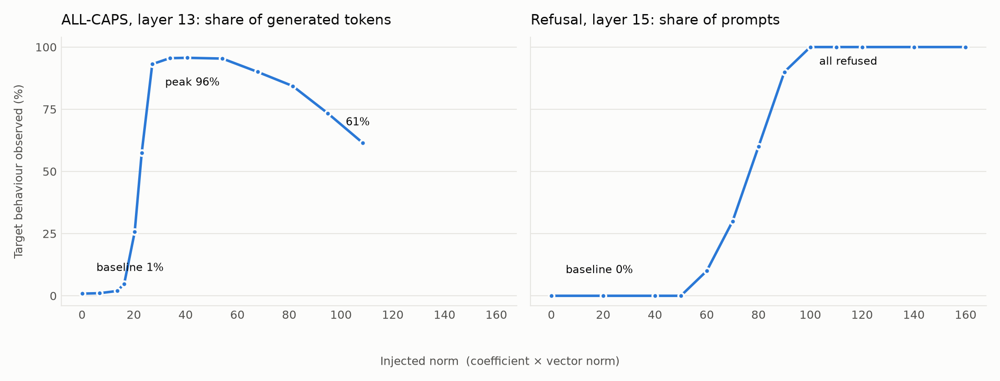

# jlens_steer

Inverting the Jacobian lens to derive activation steering vectors from concept
tokens alone, on Qwen3-1.7B. Everything runs locally on an M-series Mac.

## Getting the assets

```bash
uv venv --python 3.12 .venv
uv pip install --python .venv "huggingface_hub" torch transformers safetensors accelerate numpy
export HF_TOKEN=...                       # optional, avoids rate limits
.venv/bin/python scripts/download_assets.py
```

That pulls ~11 GB into `models/` and `artifacts/`. It is resumable and
sha256-verified, so interrupting it is safe — re-run and it continues. To
re-check what is on disk without downloading:

```bash
.venv/bin/python scripts/download_assets.py --verify
```

The weights and the J-lens tensor are gitignored; `download_assets.py` is the
record of what they are. Small derived artifacts are tracked.

## Layout

| path | what | size |
| --- | --- | --- |
| `models/Qwen3-1.7B/` | [Qwen/Qwen3-1.7B](https://huggingface.co/Qwen/Qwen3-1.7B), bf16. 28 layers, d_model 2048, tied embeddings | 4.1 GB |
| `models/Qwen3-1.7B-abliterated/` | [mlabonne/Qwen3-1.7B-abliterated](https://huggingface.co/mlabonne/Qwen3-1.7B-abliterated), fp32 | 6.9 GB |
| `artifacts/jacobian-lens/qwen3-1.7b/` | [neuronpedia/jacobian-lens](https://huggingface.co/neuronpedia/jacobian-lens), Qwen3-1.7B lens fit on Salesforce-wikitext, plus its `config.yaml` and convergence CSV | 227 MB |
| `artifacts/steering-vecs-qwen3_1_7B/caps_L13.pt` | [science-of-finetuning](https://huggingface.co/science-of-finetuning/steering-vecs-qwen3_1_7B) ALL-CAPS steering vector. Bare fp64 tensor `[2048]`, norm 27.1, for layer 13 | 20 KB |
| `artifacts/refusal_qwen3_1_7B.pt` | per-layer refusal directions `[28, 2048]`, derived here — see below | 480 KB |

| `artifacts/steering_eval.json` | sweep metrics, both behaviours | 6 KB |
| `artifacts/steering_eval_samples.json` | every completion behind those metrics | 106 KB |
| `artifacts/steering_eval.png` | measure vs coefficient, both behaviours | 140 KB |

The abliterated repo ships two redundant weight sets: the fp32 shards its
`model.safetensors.index.json` points at, and a leftover single-file bf16
`model.safetensors`. Only the indexed shards are downloaded; the leftover would
shadow the index at load time.

Of the 58 GB in the J-lens repo, only the `qwen3-1.7b/` subtree is fetched.

## Scripts

`scripts/` holds two entry points over shared modules. Sibling imports work
because running `python scripts/<name>.py` puts `scripts/` on the path.

| module | role |
| --- | --- |
| `assets.py` | repo paths and the asset registry (repo ids, destinations, file filters) |
| `hub.py` | chunked resumable downloader: ranged fetches, per-chunk retry, sha256 |
| `download_assets.py` | entry point for downloading and verifying |
| `weights.py` | safetensors shard reading and residual-writing weight diffs |
| `refusal.py` | per-layer SVD extraction, sign alignment |
| `activations.py` | harmful/harmless residual contrast on the base model |
| `extract_refusal_vector.py` | entry point for the refusal artifact |

| `eval_prompts.py` | the two 10-prompt evaluation sets |
| `steering.py` | residual-stream steering hook, batched generation |
| `metrics.py` | all-caps token counting, refusal detection |
| `plots.py` | the sweep figure |
| `eval_steering.py` | entry point for the steering sweep |

Lint and format with `ruff check scripts/` and `ruff format scripts/`; config is
in `pyproject.toml`.

## The refusal directions

Abliteration is usually described as one rank-1 edit, `W' = W - r(rᵀW)`, so the
top left singular vector of `W - W'` should be a single global refusal
direction. That is not what `mlabonne/Qwen3-1.7B-abliterated` contains. Diffing
it against the base model in fp64 shows:

- **A separate direction `r_l` per layer, not one global `r`.** Adjacent layers
  agree to cos 0.6–0.94, but `cos(r₁₅, r₀) = 0.02`. Collapsing all layers into
  one vector — top eigenvector of `Σ DᵢDᵢᵀ` — gives σ₂/σ₁ = 0.59, i.e. mostly
  noise, not a direction worth steering with.
- **`mlp.down_proj` is edited on its output axis**, `W -= (r_l r_lᵀ)W`, so the
  diff's top left singular vector is `r_l`.
- **`self_attn.o_proj` is edited on its *input* axis**, `W -= W(r_l r_lᵀ)`. Its
  top *right* singular vector matches down_proj's top left one to ~1e-6 at every
  layer. `o_proj` is square here (16 heads × 128 = 2048 = d_model), so a
  residual-space direction fits that axis by coincidence; the projection comes
  out of the concatenated head outputs rather than out of what the layer writes
  into the residual stream.
- **`embed_tokens` is untouched.**
- **Edit magnitude is a bell curve over layers, peaking at 15** — the "weight
  factors follow a normal distribution with a certain spread and peak layer"
  from the model card.

Each individual matrix *is* clean rank 1 (σ₂/σ₁ ≈ 2e-3 near the peak). The
tails degrade only because the signal shrinks toward the bf16 rounding floor,
which is also why early layers are not usable.

Independent validation: `cos(r_l, mean harmful act − mean harmless act)` reaches
**0.87** at layer 16 and stays above 0.75 through layer 27, but sits near 0.17
below layer 9. The artifact carries a `reliable` mask (cos > 0.5) marking
layers 12–27.

```bash
.venv/bin/python scripts/extract_refusal_vector.py
```

`artifacts/refusal_qwen3_1_7B.pt` holds `directions` `[28, 2048]` (unit norm,
positive = toward refusal), the `reliable` mask, the σ₁ profile, the o_proj
axis-agreement check, and `act_diff_directions` as an activation-derived
baseline.

For reference, `cos(r₁₃, caps_L13) = 0.045` — the refusal and all-caps
directions are essentially orthogonal.

## Does the steering work?

```bash
.venv/bin/python scripts/eval_steering.py
.venv/bin/python scripts/eval_steering.py --plot-only
```

Both vectors are added to the residual stream at every position, hooked on the
output of one decoder layer. 10 prompts per point, greedy decoding, 64 new
tokens.



The x-axis is the **injected norm**, `coefficient x ||vector||`, not the raw
coefficient. The two vectors have very different norms — `caps_L13.pt` ships at
norm 27.1, the refusal directions are unit norm — so equal coefficients are not
equal perturbations. Plotted this way both panels share one scale. Raw
coefficients are in `steering_eval.json` alongside `injected_norm`.

**ALL-CAPS**, the share of letter-bearing generated tokens that are all caps.
Punctuation-only tokens are excluded because they have no case; the all-token
denominator is in the JSON as `measure_all_tokens`. Baseline 1%. Nothing happens
below norm 16, then it snaps: 26% at 20, 58% at 23, 93% at 27. It peaks at 96%
between 34 and 54 and then **decays to 61% by 108** — not because the steering
weakens but because the model comes apart. At the far end it emits
`"A GOOD COPPFE is NOT JUSTICE, but also a journey"`. The published vector's own
scale, 27.1, sits right at the bottom of the usable window.

**Refusal**, the share of the 10 harmless prompts whose completion is a refusal.
Baseline 0%. Onset at 60, then 30% at 70, 60% at 80, 90% at 90, and 100% from
100 through 160 with no visible incoherence. Steered hard it declines to explain
a bicycle gear system.

So caps saturates at roughly a quarter of the injected norm refusal needs. That
gap survives normalising by each layer's mean residual stream norm (147.5 at 13,
198.7 at 15): caps needs about 18% of the residual norm, refusal about 50%.

### Why those layers

Layer 13 for caps is not a choice — the file is `caps_L13.pt`, fitted for layer
13. Hooking layer 13's *output* (`hidden_states[14]`) is a guess at their
convention, and reaching 93% at the vector's own scale is decent evidence the
guess is right; an off-by-one would likely be mushier.

Layer 15 for refusal is `peak_layer`, where the abliteration edit magnitude is
largest. Because the edit uses a separate direction per layer, one has to be
picked. Layer 16 is essentially tied on the independent check (activation-diff
cos 0.866 versus 0.864), so 15 versus 16 is arbitrary.

Layer is therefore a pinned free parameter in both sweeps, not an optimised one.
Sweeping it is the obvious next experiment.

### Measuring refusal

The detector is a regex over first-person refusal constructions plus apologies.
A substring list missed real refusals phrased "I do not wish to" and "I am not
authorized to", so it undercounted and flattened the top of the curve. The regex
version flags 40/40 of the manually-confirmed refusals at injected norm >= 100
and 0/40 of the unsteered helpful completions, so it is clean in both directions
on this data.

Two caveats. Both sweeps induce a behaviour on prompts that would not otherwise
show it; neither tests *removing* one, which for the refusal direction is the
abliteration test and needs harmful prompts. And every completion is greedy, so
each point is 10 single samples, not a rate over a distribution.

## A note on this network

Long TLS streams to the HF CDN die partway through here with `[SSL] record
layer failure`, and `snapshot_download` discards the partial file, so retries
never advance. Ranged requests of a few tens of MB do succeed. Hence the
chunked downloader: 16 MiB ranges written at fixed offsets into a preallocated
`.part`, a sidecar recording which chunks landed, per-chunk retry, sha256 before
publishing.
